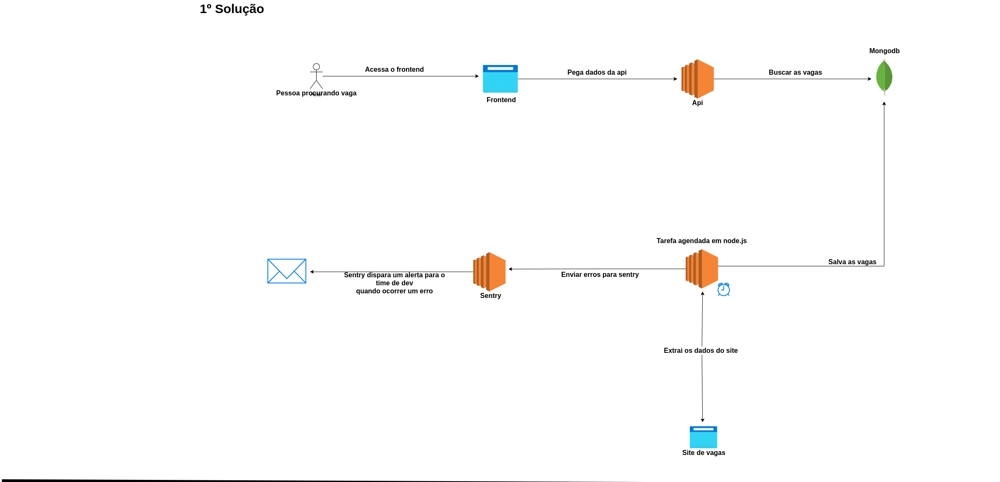

O que é o Junta vagas:
========================

Tem a finalidade de centralizar vagas para programador de vários sites  em um único lugar.

Arquitetura que será utilizada no projeto:
=============================================

- Tecnologias que serão utilizadas:
	- Frontend
		- Next.js
		- Tailwind
	- Api
		- Node.js
		- Javascript
		- Express.js
	- Banco de dados
		- Mongodb
    - Jobs(tarefas em background)
	    - Node.js
	    - Javacript
	    - Cron job para executa script em um determinado horário
	    - Sentry ferramenta para monitorar exceptions que possam ocorrer nas tarefas em background e notificar o time de devs
	
-    Explicação do uso das tecnologias
	 - Frontend
		 - Next.js com ele podemos utilizar o recurso de **SSR**  que irá permitir retorna uma página com conteúdo quando o robô de SEO do google for analisar a aplicação é irá ter um melhor rankeamento, pois não terá uma página com sem conteúdo.
		 - Tailwind como ele é muito utilizado nós projetos do **Fullstack master** creio que o time está mais familiarizado.

	 - Api
		 - Node.js e javascript serão utilizados pela boa performance e também devido o time já estar familiarizado com essas tecnologias
		 - Express.js devido a sua simplifica para criar um aplicação, também pelo fato de que não iremos desenvolver coisas extremamente complexas então não faz sentido utilizar Nest.js e pelo fato que o time já possui experiência com express.js.
     - Banco de dados
	    - Mongodb como o cenário do **Junta vaga** não é necessário controle de transações, e não precisa validações de tipos de dados mais restritiva, pelo fato de usar a flexibilidade da estrutura do banco sem gerar grande impacto como aconteceria em banco de dados **SQL**  e por final devido podemos configurar o mongodb no Mongo atlas que tem um **free tier** interessante.
	- Jobs(tarefas em background)
		- Node.js e javascript os motivos já foram explicados acima.
		- Cron job também conhecido como **tarefa agendada** onde um determinada tarefa executa é um horário especificado. No cenário do Junta vagas que pegar vagas de outros sites novas vagas podem aparecer de um dia para outro, então pode criar um tarefa agendada para extrair os dados por exemplo as 23h que pegar as novas vagas dos sites é coloca no banco de dados
		- Sentry essa um ferramenta que será utilizada para monitorar os erros das tarefas agendas. Como são tarefas em background você não consegui ver o erro com se vem em um api ou no frontend, então você só irá descobrir quando parar de funcionar. É ai entra o Sentry onde nós vamos capturar os erros dos jobs é envia para o Sentry que irá nós alerta o team de devs envia email por exemplo quando ocorrer um erro. 
	
	

