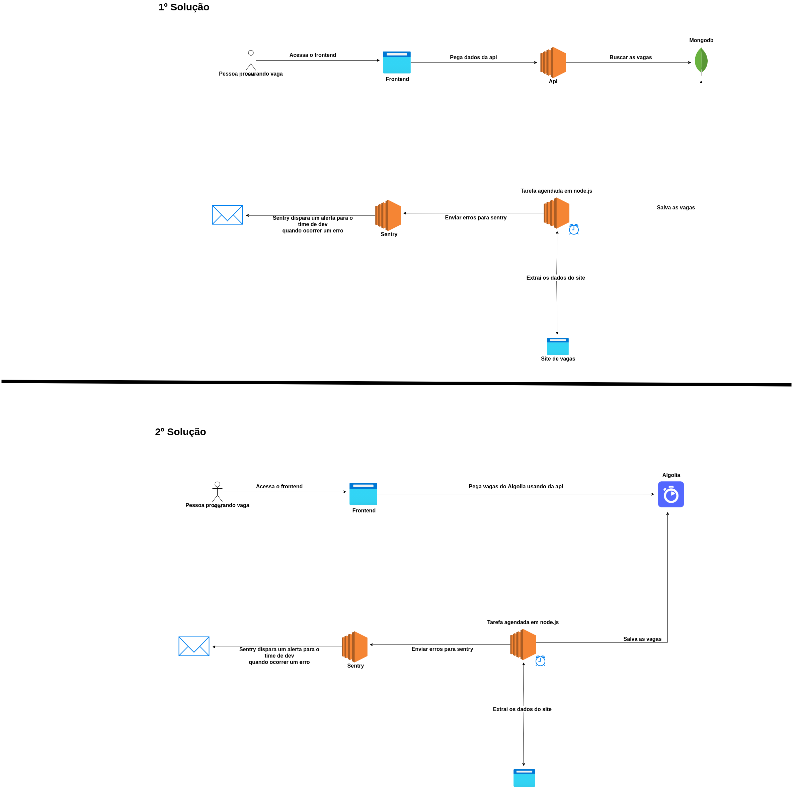

**Junta vaga**

Analisando os requisitos do projeto abaixo tem 2 arquiteturas que estou propondo para vocês para o projeto.

Imagem:



As arquiteturas são o resultado da minha analise das necessidades **MUST HAVE** do projeto é também o documento tem a finalidade de dar um visão de como será o fluxo da aplicação e os componentes utilizados.


**1º solução arquitetural**

- Tecnologias sugeridas:
	- Frontend
		- Next.js
		- Tailwind
	- Api
		- Node.js
		- Javascript
		- Express.js
	- Banco de dados
		- Mongodb
    - Jobs(tarefas em background)
	    - Node.js
	    - Javacript
	    - Cron job para executa script em um determinado horário
	    - Sentry ferramenta para monitorar exceptions que possam ocorrer nas tarefas em background e notificar o time de devs
	
-    Explicação do uso das tecnologias
	 - Frontend
		 - Next.js com ele podemos utilizar o recurso de **SSR**  que irá permitir retorna uma página com conteúdo quando o robô de SEO do google for analisar a aplicação é irá ter um melhor rankeamento, pois não terá uma página com sem conteúdo.
		 - Tailwind como ele é muito utilizado nós projetos do **Fullstack master** creio que o time está mais familiarizado.

	 - Api
		 - Node.js e javascript serão utilizados pela boa performance e também devido o time já estar familiarizado com essas tecnologias
		 - Express.js devido a sua simplifica para criar um aplicação, também pelo fato de que não iremos desenvolver coisas extremamente complexas então não faz sentido utilizar Nest.js e pelo fato que o time já possui experiência com express.js.
     - Banco de dados
	    - Mongodb como o cenário do **Junta vaga** não é necessário controle de transações, e não precisa validações de tipos de dados mais restritiva, pelo fato de usar a flexibilidade da estrutura do banco sem gerar grande impacto como aconteceria em banco de dados **SQL**  e por final devido podemos configurar o mongodb no Mongo atlas que tem um **free tier** interessante.
	- Jobs(tarefas em background)
		- Node.js e javascript os motivos já foram explicados acima.
		- Cron job também conhecido como **tarefa agendada** onde um determinada tarefa executa é um horário especificado. No cenário do Junta vagas que pegar vagas de outros sites novas vagas podem aparecer de um dia para outro, então pode criar um tarefa agendada para extrair os dados por exemplo as 23h que pegar as novas vagas dos sites é coloca no banco de dados
		- Sentry essa um ferramenta que será utilizada para monitorar os erros das tarefas agendas. Como são tarefas em background você não consegui ver o erro com se vem em um api ou no frontend, então você só irá descobrir quando parar de funcionar. É ai entra o Sentry onde nós vamos capturar os erros dos jobs é envia para o Sentry que irá nós alerta o team de devs envia email por exemplo quando ocorrer um erro. 
	
	
	
**2º solução arquitetural**

- Tecnologias sugeridas:
	- Frontend
		- Next.js
		- Tailwind
	- Banco de dados
		- Algolia
    - Jobs(tarefas em background)
	    - Node.js
	    - Javacript
	    - Cron job para executa script em um determinado horário
	    - Sentry ferramenta para monitorar exceptions que possam ocorrer nas tarefas em background e notificar o time de devs
	
-    Explicação do uso das tecnologias
	 - Frontend
		 - Next.js com ele podemos utilizar o recurso de **SSR**  que irá permitir retorna uma página com conteúdo quando o robô de SEO do google for analisar a aplicação é irá ter um melhor rankeamento, pois não terá uma página com sem conteúdo.
		 - Tailwind como ele é muito utilizado nós projetos do **Fullstack master** creio que o time está mais familiarizado.
     - Banco de dados
	    - Algolia é um serviço https://www.algolia.com/ que permiti fazer consultas de dados de forma muito poderosa. Exemplo de aplicação dessa ferramenta é o github se você pesquisa no campo de pesquisa do github por um palavra ele irá retorna todos os registros que possui esse palavra e rápidamente. O motivou para selecionar essa tecnologia é pela o poder de conseguir fazer consultas muito poderosas e de forma rápida e possui free tier.
	 - Jobs(tarefas em background)
		- Node.js e javascript os motivos já foram explicados acima.
		- Cron job também conhecido como **tarefa agendada** onde um determinada tarefa executa é um horário especificado. No cenário do Junta vagas que pegar vagas de outros sites novas vagas podem aparecer de um dia para outro, então pode criar um tarefa agendada para extrair os dados por exemplo as 23h que pegar as novas vagas dos sites é coloca no banco de dados
		- Sentry essa um ferramenta que será utilizada para monitorar os erros das tarefas agendas. Como são tarefas em background você não consegui ver o erro com se vem em um api ou no frontend, então você só irá descobrir quando parar de funcionar. É ai entra o Sentry onde nós vamos capturar os erros dos jobs é envia para o Sentry que irá nós alerta o team de devs envia email por exemplo quando ocorrer um erro. 


**Para rodar projeto em produção**

- 1º Solução arquitetural proposta
	- Serviços que podem ser utilizados:
		- Frontend
			- Vercel pois consegui rodar aplicação de forma gratuita
		- Api
			- Heroku pois consegui rodar aplicação de forma gratuita e também porque ele gerencia sua aplicação para você
		- Banco de dados
			- Mongo atlas pois permite criar um banco de dados de forma simples e gratuitamente
		- Jobs
			- Heroku 
			-  Sentry pois consegui usar versão gratuita
			  
- 2º Solução arquitetural proposta
	 - Serviços que podem ser utilizados:
		- Frontend
			- Vercel pois consegui rodar aplicação de forma gratuita
		- Banco de dados
			- Algolia pois tem um versão gratuita que inicialmente é interessante, simplicidade de configurar e facilidade de usar.
		- Jobs
			- Heroku 
			-  Sentry pois consegui usar versão gratuita


**Tecnologias complementares para usar no desenvolvimento do projeto**
 - Git caso não saiba existe um modulo no curso **Fullstack master** sobre o tema
 - Docker e Docker compose não é necessário saber eu irei configurar é deixar pronto. A finalidade dessa ferramenta é ajudar a rodar o banco de dados localmente na máquina de forma simples. Caso queira abre segui os links de apoio:
	 - Artigo: https://www.linkedin.com/pulse/dicas-r%25C3%25A1pidas-docker-dockerfile-e-compose-tiago-rosa-da-costa/?trackingId=vsRgqeuheHLpSmHQ7zLwLQ%3D%3D
	 - Vídeo: https://www.youtube.com/watch?v=Dt8hu3r7toI&fbclid=IwAR0r8YoQ34jS5cMcNcCaz1Y5EdHgk_DENv9Qe8W-Qa1O_hkkAdcU158kfwQ


**Fluxo de git para trabalhar no projeto**
- Branchs principais:
	- **Master** contém o código que vai para produção
	- **Staging** contém o código que vai para o ambiente de teste para ser válido e que depois vai para o branch **Master**
	- **Develop** é o branch base para criar novas funcionalidades na aplicação.
- Novas features:
   - Executar o comando **git pull origin develop** antes de criar um novo branch **feature** para pegar  as atualizações
	- Criar um branch baseado no **develop** onde ele irá possuir a seguinte padrão de nome **feature/nome_da_feature** é a partir dai você começa o seu desenvolvimento
	- Quando finalizar a feature deve enviar o código para o repositório remoto é abrir uma **pull request** do seu branch feature para a **develop** onde irá conter um revisor no mínimo. 
	- Assim que aprovado é mergeado na develop o revisor abri uma **pull request** do branch **develop** para o **staging**
	- Aprovado e mergeado o **pull request** feito para o branch **staging** deve ser abrir uma **pull request** do branch **staging** para o **master**, porém antes de aprovar deve ser validado se está ok a nova funcionalidade no ambiente de **staging**, se está ok, aprovar **pull request** aberto para o branch **master**


**Estrutura inicial do projeto**

Essa é a estrutura que estou propondo para código da aplicação onde irá ter o **backend** e **frontend** no mesmo repositório com a finalidade de simplificar tendo tudo em um único lugar. Obs: o **backend** e **frontend** não vou compartilhar modules, cada irá ter o seu **node_modules**
```
junta-vagas
|
| -- backend // Diretório backend tem o código do backend
| ------- src // Todo o código fonte ficar aqui
| ----------- routes // Diretório onde fica as rotas da aplicação
| ----------- index.js	
| -- frontend // Diretório frontend onde fica o código do frontend que segue a estrutura do palpitebox
| ------- pages
| ------- utils
| ------- components
| ------- public
| ------- css
| -- documents // São todos os documentos sobre o projeto
```
